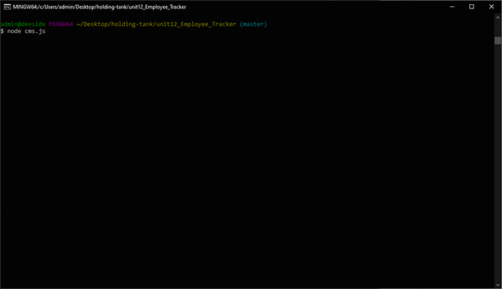
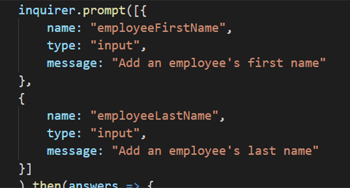

# Employee Tracker

Employee Tracker was created with Javascript, Node Js, Mysql, and Inquirer. When run in the command-line, the user is prompt with a message "What would you like to do?" with a series of choices. The user then can Add: departments, roles, employees; View: departments, roles, employees; and update employee roles.

## Take aways! 

This was driving me mad! Two prompts for one ask. For adding "First and Last Name" I had the syntax correct. The only thing I didn't do is put it in an array, I was missing []. The array contains the two questions.

### Prerequisites

From repository, (https://github.com/itsmedexter/unit12_Employee_Tracker), download cms.js, employeeSchema.sql, package-lock.json. Use Command-line or Terminal, go to the directory where you downloaded the files to. In the command line, type "npm install -y", this looks at the package-lock.json  and install the correct packages to run this program. After the installation, in the command line, make sure you are still in the same directory where "cms.js" is located, type "node cms.js". This should run the program and give you a prompt on what to do. 

## Built With
* [HTML](https://developer.mozilla.org/en-US/docs/Web/HTML)
* [CSS](https://developer.mozilla.org/en-US/docs/Web/CSS)
* [InquirerJs](https://www.npmjs.com/package/inquirer/v/0.2.3)
* [MySql] (https://www.npmjs.com/package/mysql)
* [console.table](https://www.npmjs.com/package/console.table)
* [NodeJs] (https://nodejs.org/en/about/)
* [NPM] (https://www.npmjs.com/)

## Deployed Link
* No direct link, please see "Prerequisites" above on how to run "cms.js".

## Authors
Dexter Valencia 

- [Link to Employee Tracker repository](https://github.com/itsmedexter/unit12_Employee_Tracker)
- [Link to Github](https://github.com/itsmedexter)
- [Link to LinkedIn](https://www.linkedin.com/in/dextervalencia/)

## License

This project is licensed under the MIT License 

## Acknowledgments

* Thanks to Kerwin for guiding/helping me with prompts to work properly.  
